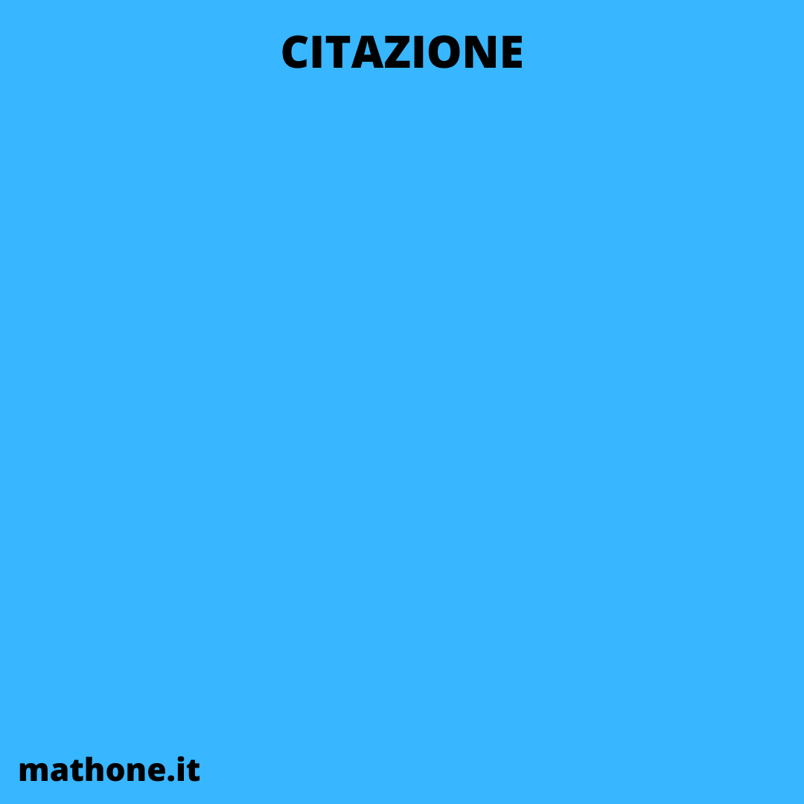

# CITAZIONI

Immagine da usare come background:

### CITAZIONE 1

#### [Citazione](citazioni/citazione1.md)

#### [Commento](commentiCitazioni/commento1.md)

### CITAZIONE 2

#### [Citazione](citazioni/citazione2.md)

#### [Commento](commentiCitazioni/commento2.md)

---

# Nuova settimana
