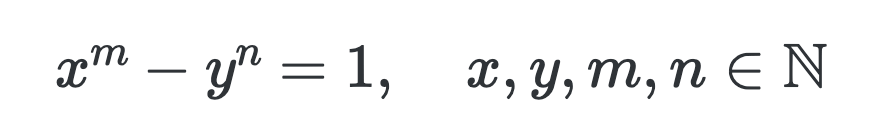

# CURIOSITÀ MATEMATICHE

>**REGOLA** Mettere sempre nel post solo l'immagine, mentre nella descrizione mettere il testo.

Immagine da usare come background:

### Curiosità della settimana

**Catalan Conjecture**

Nel 1844 il matematico belga Eugène Catalan fece una domanda intrigante sui numeri 8 e 9. Inviò questa lettera dicendo ‘La prego, signore, di annunciare per favore nel suo diario il seguente teorema che ritengo vero anche se non sono ancora riuscito a dimostrarlo completamente; forse altri avranno più successo. Due numeri interi consecutivi, diversi da 8 e 9, non possono essere potenze consecutive; altrimenti detto, l'equazione x^m – y^n = 1 in cui le incognite sono interi positivi (maggiori di 1) ammette una sola soluzione.'

Questa affermazione divenne nota come "Catalan Conjecture". Preda Mihăilescu lo ha finalmente dimostrato nel 2002 utilizzando metodi avanzati della teoria algebrica dei numeri.

Estratto da: Ian Stewart. "Professor Stewart's Incredible Numbers".