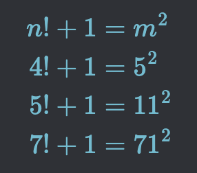

# CURIOSITÀ MATEMATICHE

>**REGOLA** Mettere sempre nel post solo l'immagine, mentre nella descrizione mettere il testo.

Immagine da usare come background:

### Curiosità della settimana

Se consideri tutti i numeri da 1 a n e li moltiplichi tra loro, ottieni 'n fattoriale', che è scritto come n!. I fattoriali determinano in quanti modi n oggetti possono essere ordinati. Se aggiungiamo 1 a questi numeri otteniamo 'n! + 1' e ne riconosciamo tre come quadrati perfetti, cioè
4! + 1 = 5^2
5! + 1 = 11^2
7! + 1 = 71^2.
Non si conoscono altri numeri simili, ma non è stato dimostrato che nessun numero più grande di 7 restituisce un quadrato perfetto della forma n!+1. Questo è chiamato 'problema di Brocard', perché nel 1876 Henri Brocard chiese se 7 fosse il numero più grande con questa proprietà. 

Più tardi, Paul Erdős ha ipotizzato che la risposta fosse "no". Nel 2000 Bruce Berndt e William Galway hanno dimostrato che non ci sono altre soluzioni con n minore di 1 miliardo. Nel 1993 Marius Overholt ha dimostrato che esistono solo un numero limitato di soluzioni, ma solo assumendo un importante problema irrisolto nella teoria dei numeri chiamato congettura ABC".

Estratto e tradotto da: Ian Stewart. “Professor Stewart's Incredible Numbers”. 