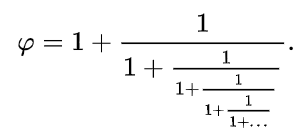

# CURIOSITÀ MATEMATICHE

>**REGOLA** Mettere sempre nel post solo l'immagine, mentre nella descrizione mettere il testo.

Immagine da usare come background:

### Curiosità della settimana

E' perfettamente sensato matematicamente dire che ci sono numeri irrazionali più irrazionali di altri. Le migliori approssimazioni razionali di un numero si ottengono costruendo la sua espansione in frazioni continue, che definisce una sequenza di numeri razionali che sono le successive migliori approssimazioni del numero in esame. Per determinare quanto sia irrazionale un numero, si può quindi osservare quanto lentamente converge ad esso la sua espansione in frazioni continue. Seguendo questo ragionamento, il "numero più irrazionale" è quello la cui sequenza di numeri razionali prima definita converge più lentamente. Questo è la sezione aurea, la cui frazione continua associata è riportata qui sotto.

---

# Nuova settimana

