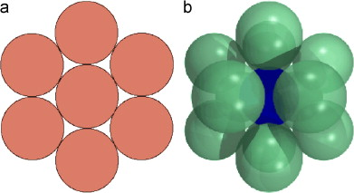

# CURIOSITÀ MATEMATICHE

>**REGOLA** Mettere sempre nel post solo l'immagine, mentre nella descrizione mettere il testo.

Immagine da usare come background:

### Curiosità della settimana

Si chiama "kissing number" il maggior numero di iper-sfere di un certo raggio che possono toccare un'altra iper-sfera dello stesso raggio. Nel piano questo si riduce al maggior numero di cerchi, di una data dimensione, che possono toccare un cerchio della stessa dimensione. Esso è uguale a 6. La dimostrazione richiede solo la geometria Euclidea elementare.

Nello spazio tridimensionale questo numero è il maggior numero di sfere, di una data dimensione, che possono toccare una sfera dello stesso raggio. Esso è uguale a 12. La dimostrazione in questo caso è molto più difficile e per molto tempo non si sapeva solamente se 13 sfere potessero funzionare.

Estratto da: Ian Stewart. "I numeri incredibili del professor Stewart".