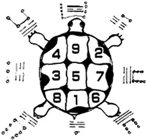
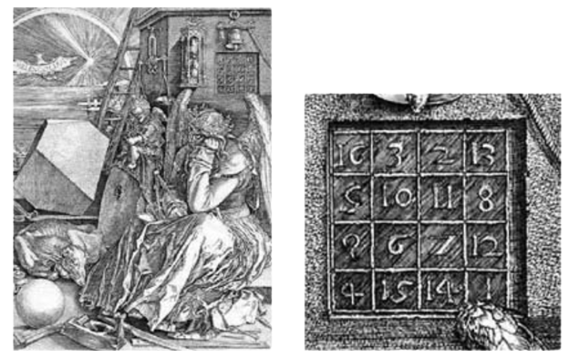

# CURIOSITÀ MATEMATICHE

>**REGOLA** Mettere sempre nel post solo l'immagine, mentre nella descrizione mettere il testo.

Immagine da usare come background:

### Curiosità della settimana

Secondo una leggenda Cinese, l'imperatore Yu che visse nel 3° millennio AC, incontrò una tartaruga sacra, nel Fiume Giallo, cone delle strane incisioni sul guscio (la vedi in figura). Queste incisioni sono ora note come il "Lo shu". 

I numeri incisi sul guscio hanno la proprietà di avere ogni riga, colonna e diagonale che somma a 15. Un po' come nel sudoku, dove però sommano a 45. 

Un quadrato di numeri con questa proprietà è detto "magico" e la somma è detta "costante magica". 

Nel 1514 l'artista Albrecht Dürer ha produtto un incisione intitolata "Malinconia", contenente in alto a destra un quadrato magico 4x4 di costante 34. Lo puoi vedere nella figura del post.

C'è una letteratura davvero sviluppata per quanto riguarda i quadratic magici. Per esempio si sa esattamente che esiste solo un quadrato magico 3x3, 880 4x4 e 275.305.224 di dimensione 5x5. Se vuoi affrontare un problema non risolto, prova a calcolare quanti ce ne sono di dimensione 6x6 😎. Asintoticamente si sa che sono 1.77x10^19, pochi insomma!

Se vuoi invece approfndire il problema e l'argomento, puoi andare al sito  .

(Fonte : Libro "Professor Stewarts cabinet of mathematical curiosities")

---

### Nuova settimana

Ernst Kummer è stato un algebrista tedesco, uno tra i maggiori contributori alla dimostrazione dell'ultimo Teorema di Fermat prima dell'era moderna. Detto ciò, lui era abbastanza "scarso" in aritmetica, a tal punto che doveva sempre chiedere ai suoi studenti di fargli i calcoli. In una circostanza si trovò a dover calcolare 9x7. 'Umm...9 per 7 è ... 9 per ... 7 ... è ...'. Uno studente suggerì '61'. Kummer scrisse quindi questo risultato alla lavagna. 'No, professore! Dovrebbe essere 67!', disse un altro. 'Dai su, ragazzi', disse Kummer. 'Non possono essere veri entrambi. Deve essere uno o l'altro'.

Leggenda o realtà? Sta di fatto che è vero che per essere un bravo matematico non è condizione nè necessaria nè sufficiente essere delle brave calcolatrici 😎