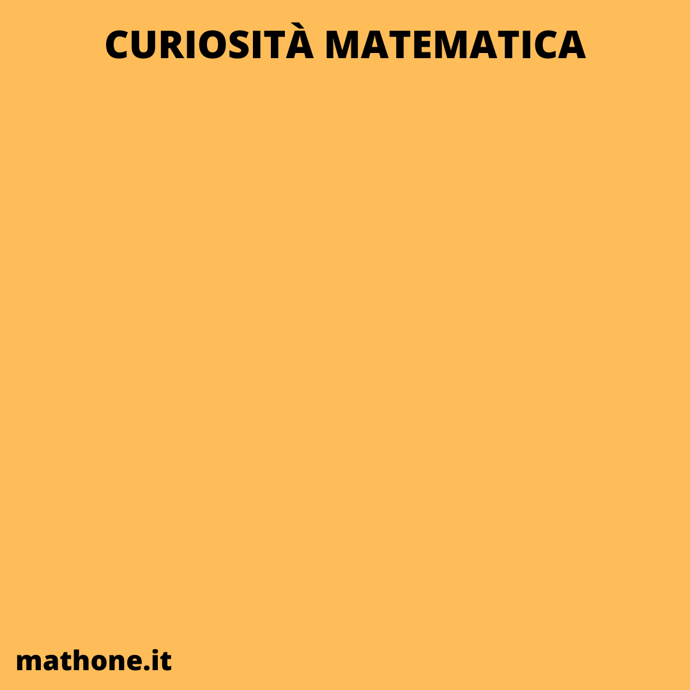
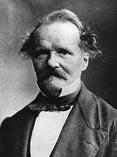

# CURIOSITÀ MATEMATICHE

>**REGOLA** Mettere sempre nel post solo l'immagine, mentre nella descrizione mettere il testo.

Immagine da usare come background:

### Curiosità della settimana

Il simbolo "=" è stato inventato nel 1557 dal matematico Gallese Robert Recorde. Lui era stufo di scrivere "è uguale a" nelle sue equazioni. Così, introdusse il simbolo a cui siamo abituati. Motivò questa scelta dicendo che "non ci sono due cose più uguali delle due linee nel simbolo".

