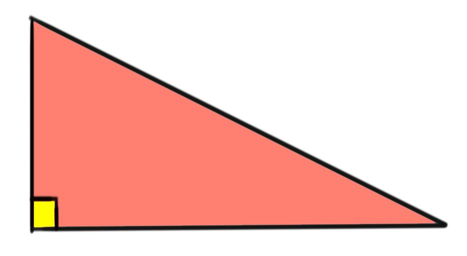

# FATTI STORICI

>**REGOLA** Mettere sempre nel post solo l'immagine, mentre nella descrizione mettere il testo.

Immagine da usare come background:

### Fatto storico della settimana

In una tavoletta babilonese, ora a Berlino, la diagonale di un rettangolo di lati 40 e 10 è risolta come 40 + 10^2/(2 × 40). Qui viene utilizzata una regola di approssimazione molto efficace (che la radice quadrata della somma di a^2 + b^2 può essere stimata come a + b^2/(2 x a)), la stessa regola che si trova frequentemente nelle scritture geometriche greche successive. Entrambi questi esempi di radici illustrano l'approccio aritmetico dei babilonesi in geometria. Mostrano anche che i babilonesi erano a conoscenza della relazione tra l'ipotenusa e i due lati di un triangolo rettangolo (ora comunemente noto come teorema di Pitagora) più di mille anni prima che i greci lo usassero.