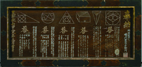

# FATTI STORICI

>**REGOLA** Mettere sempre nel post solo l'immagine, mentre nella descrizione mettere il testo.

Immagine da usare come background:

### Fatto storico della settimana

Anno : 1610

Galileo Galilei pubblica Sidereus Nuncius (Messaggio dalle stelle) che descrive le scoperte astronomiche che ha fatto con i suoi telescopi. Harriot osserva anche le lune di Giove ma non pubblica il suo lavoro. Durante le notti di quegli anni, Galilei osservò la volta stellata facendo osservazioni talmente rivoluzionarie da far crollare l'intera impalcatura dell'astronomia e della cosmologia aristotelico-tolemaica.

Prima di tutto individuò delle montagne e crateri sulla superficie della Luna, fino ad allora ritenuta completamente liscia e composta di materia celeste incorruttibile.

Identificò poi la Via Lattea come un enorme gruppo di stelle e corpi celesti, raggruppati in ammassi. Per concludere questa breve panoramica, è importante ricordare come Galileo si concentrò anche su Giove, di cui scoprì 4 satelliti naturali, che chiamò "pianeti medicei". Ragionando sulle somiglianze di questi satelliti con la Luna, stabilì che Giove fosse un pianeta con parecchie somiglianze alla Terra.

---

# Nuova settimana

Per oltre 200 anni, il Giappone rimase isolato dal resto del mondo per quanto riguarda idee e cultura. Questo periodo durò dal 1603 al 1868. In questi anni la geometria Euclidea rimase sconosciuta in Giappone, dove prima di questi anni la matematica fu influenzata da quella cinese. 

Intorno al 1631, la matematica Giappponese iniziò a diventare popolare tra la gente, come un modo di divertirsi e di mettersi alla prova. Si concentravano prevalentemente sulla geometria piana, usando triangoli, poligoni e cerchi. Uno dei mezzi di comunicazione dei problemi, sfide e risultati di geometria è chiamato "Sangaku", ed è raffigurato nella figura del post. 

Questi oggetti erano delle tavolette matematiche. Queste tavolette, ricche di rappresentazioni artistiche, erano esposte nei templi buddisti e riportavano sfide per i visitatori, che cercavano delle soluzioni a questi problemi. Queste tavolette riportavano problemi legati alle applicazioni di geometria di base, senza nessun nuovo teorema. Comunque, risolvendoli, qualche idea nuova ed interessante si iniziò a sviluppare, ma molte di queste si persero negli anni e non si diffusero nel XVIII secolo. 

Nel 1790, il matematico Fujita Kagen pubblicò la prima colezione di questi problemi nel suo libro "Shimpeki Sampo", seguito dal secondo volume "Zoku Shimpeki Sampo".

La complessità dei problemi riportati varia molto, però uno studente con conoscenze della scuola superiore moderna dovrebbe essere in grado di risolvere la maggior parte di essi. Tali livelli di difficoltà evolsero nel tempo, fino a passare a problemi più difficili nel XVIII secolo, come quello di inserire sfere all'interno di coni. 

A causa della distruzione di alcuni templi buddisti, molte tavolette andarono perse. Ad oggi esistono circa 900 di queste.

(Fonte : Libro "Mathematical Curiosities - A Treasure Trove of Unexpected Entertainments")

