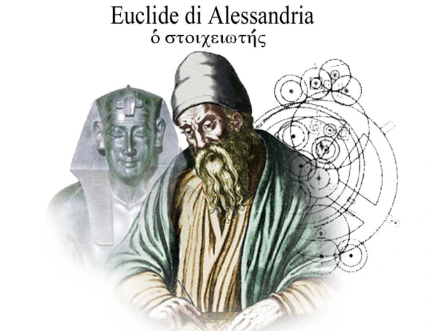

# FATTI STORICI

>**REGOLA** Mettere sempre nel post solo l'immagine, mentre nella descrizione mettere il testo.

Immagine da usare come background:

### Fatto storico della settimana

Alessandria fu la patria di vari matematici, tra cui Proclo (410-485). Lui si trasferl ad Atene dove divenne capo della scuola neoplatonica. Proclo era più un filosofo che un matematico, ma le sue osservazioni sono spesso una preziosa fonte di informazioni sulla storia dei primi sviluppi della geometria greca. Sotto questo punto di vista riveste una grande importanza il suo Commento al primo libro degli Elementi di Euclide. Infatti, mentre lo scriveva, Proclo aveva in mano una copia della Storia della geometria di Eudemo, oggi perduta, ed il Commento agli Elementi di Pappo, anch'esso andato in gran parte perduto. 

Per le nostre conoscenze sulla storia della geometria prima di Euclide dipendiamo in larga misura da Proclo, che incluse nel suo Commento un riassunto o una porzione sostanziale della Storia di Eudemo. Questo passo, che doveva diventare noto come l'Epitome eudemiana, può essere considerato come il principale contributo di Proclo alla matematica.

(Tratto da "Storia della matematica" di Boyer)