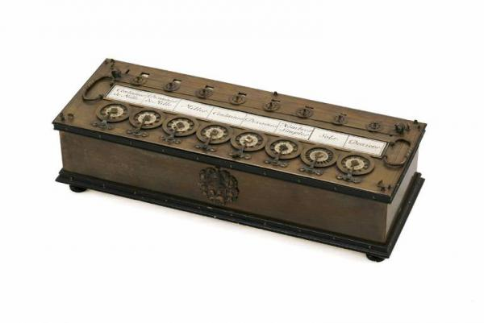

# FATTI STORICI

>**REGOLA** Mettere sempre nel post solo l'immagine, mentre nella descrizione mettere il testo.

Immagine da usare come background:

### Fatto storico della settimana

Il padre di Blaise Pascal, Étienne Pascal, oltre ad essere anch'egli un brillante matematico, per lavoro doveva spesso svolgere lunghi ed impegnativi calcoli. Il diciannovenne Blaise, lavorò all'invenzione per aiutare il padre nello svolgimento della sua professione. Dopo la realizzazione di alcuni prototipi, lui trovò un abile artigiano orologiaio che gli costruì un primo esemplare nel 1645 per presentarlo a Pierre Seguire, cancelliere del cardinale Richelieu, che lo incoraggiò a migliorare la sua invenzione.

Nel 1649 Luigi XIV concesse a Blaise Pascal l'esclusiva per la produzione e la commercializzazione della pascalina ed egli avviò un'articolata pubblicizzazione in tutta Europa mediante la corrispondenza epistolare con molti letterati e studiosi di sua conoscenza e un articolo, apparso nel 1652, sul periodico Muse Historique. 

A seguito dei primi incoraggianti successi, Pascal fece realizzare dallo stesso orologiaio di Rouen diversi altri esemplari di pascalina, circa una cinquantina. Pascal donò alcuni esemplari ad eminenti personaggi europei, come la regina Cristina di Svezia, la duchessa Maria Luisa Gonzaga e la regina di Polonia, Maria Luisa de la Grange d'Arquien. Inoltre, tramite il fisico olandese Christiaan Huygens, un modello fu condotto a Londra, dove fu presentato alla Royal Society ottenendo le lodi di Robert Hooke, malgrado il suo iniziale scetticismo.

Successivamente lo sviluppo della pascalina ebbe un arresto a seguito della crisi mistica che colse Blaise Pascal nel 1650 e che lo portò ad accantonare gli studi scientifici per dedicarsi prevalentemente alla filosofia.

Soltanto nove di questi esemplari della produzione originale sono sopravvissuti fino ai nostri giorni. 

(Fonte Wikipedia)