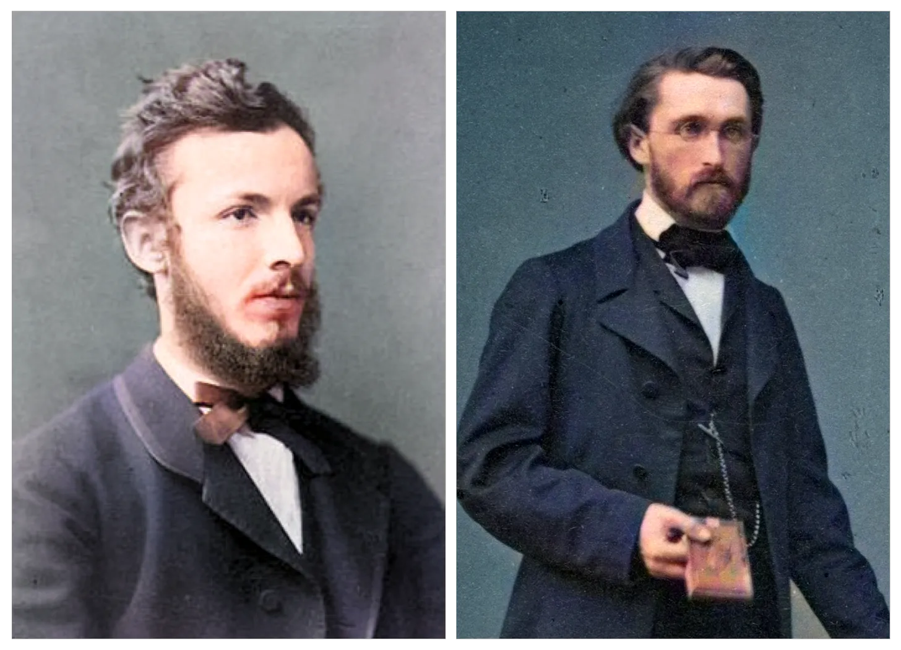

# FATTI STORICI

>**REGOLA** Mettere sempre nel post solo l'immagine, mentre nella descrizione mettere il testo.

Immagine da usare come background:

### Fatto storico della settimana

La definizione di Dedekind di un insieme infinito apparve nel 1872 nel suo libro "Stetigkeit und irrationale Zahlen". Nel 1888 Dedekind svilupperà le proprie idee in un altro importante trattato, "Was sind und was sollen die Zahlen" (Che cosa sono e che cosa dovrebbero essere i numeri). Nel 1874 Cantor si sposò, e durante il suo viaggio di nozze si fermò a Interlaken, dove incontrò Dedekind. In quello stesso anno Cantor pubblicò sul Journal di Crelle uno dei suoi articoli più rivoluzionari. Anch'egli, come Dedekind, aveva riconosciuto la proprietà fondamentale degli insiemi infiniti, ma, diversamente da Dedekind, Cantor si rese conto che non tutti gli insiemi infiniti erano simili. Nel caso di insiemi finiti, diversi insiemi di elementi hanno lo stesso numero di elementi se possono essere messi in corrispondenza 1 a 1 gli uni con gli altri. In maniera abbastanza analoga, Cantor si costruì una gerarchia di insiemi infiniti a seconda della "potenza" dell'insieme. L'insieme dei quadrati perfetti o l'insieme dei numeri triangolari ha la stessa potenza dell'insieme di tutti i numeri interi positivi, per il fatto che questi gruppi possono essere messi in corrispondenza biunivoca l'uno con l'altro. Questi insiemi sembrano essere molto più piccoli dell'insieme di tutte le frazioni razionali; tuttavia Cantor mostrò come anche quest'ultimo insieme sia numerabile, ossia anch'esso possa essere messo in corrispondenza 1-1 con l'insieme dei numeri interi positivi, e pertanto abbia la stessa potenza.

(Fonte : "Storia della matematica"  di Boyer)