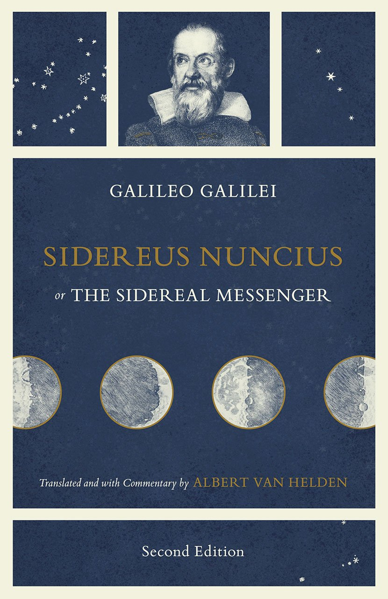

# FATTI STORICI

>**REGOLA** Mettere sempre nel post solo l'immagine, mentre nella descrizione mettere il testo.

Immagine da usare come background:

### Fatto storico della settimana

Anno : 1610

Galileo Galilei pubblica Sidereus Nuncius (Messaggio dalle stelle) che descrive le scoperte astronomiche che ha fatto con i suoi telescopi. Harriot osserva anche le lune di Giove ma non pubblica il suo lavoro. Durante le notti di quegli anni, Galilei osservò la volta stellata facendo osservazioni talmente rivoluzionarie da far crollare l'intera impalcatura dell'astronomia e della cosmologia aristotelico-tolemaica.

Prima di tutto individuò delle montagne e crateri sulla superficie della Luna, fino ad allora ritenuta completamente liscia e composta di materia celeste incorruttibile.

Identificò poi la Via Lattea come un enorme gruppo di stelle e corpi celesti, raggruppati in ammassi. Per concludere questa breve panoramica, è importante ricordare come Galileo si concentrò anche su Giove, di cui scoprì 4 satelliti naturali, che chiamò "pianeti medicei". Ragionando sulle somiglianze di questi satelliti con la Luna, stabilì che Giove fosse un pianeta con parecchie somiglianze alla Terra.

