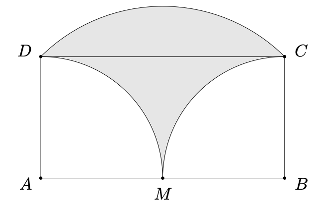
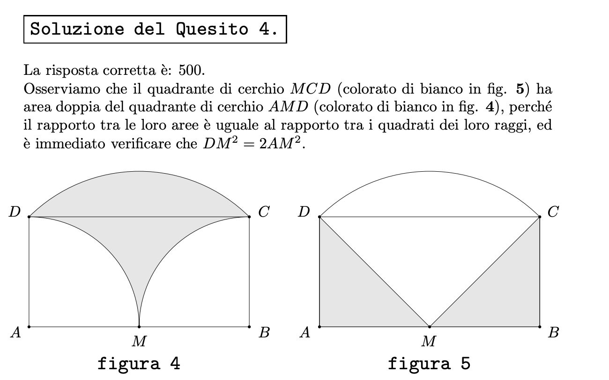
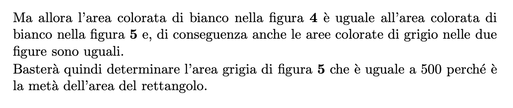

# INDOVINELLI MATEMATICI

> Postare un carosello con prima immagine che ha l'indovinello e seconda la soluzione.
>**SE** non ci stanno sia immagine che testo, mettete solo l'immagine e il testo metterlo in descrizione.

Immagine da usare come background:

### Indovinello della settimana

Il rettangolo ABCD ha area 1000. Inoltre l’arco MD ha centro in A, l’arco MC ha centro in B e l’arco CD ha centro in M. Quanto vale l’area
colorata in grigio in figura?

In settimana pubblicherò un video sul canale in cui presento una soluzione al problema.

**Non pubblicate la soluzione, è per me.**

