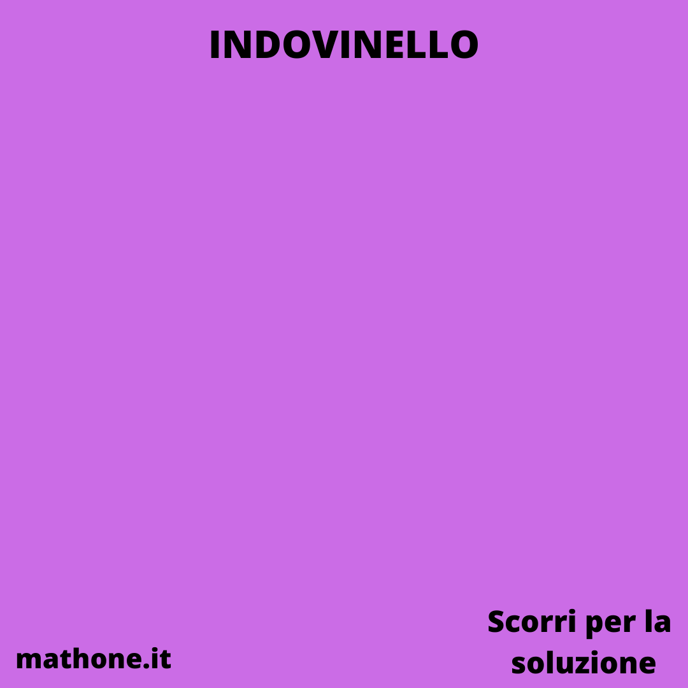

# INDOVINELLI MATEMATICI

> Postare un carosello con prima immagine che ha l'indovinello e seconda la soluzione.
>**SE** non ci stanno sia immagine che testo, mettete solo l'immagine e il testo metterlo in descrizione.

Immagine da usare come background:

### Indovinello della settimana

### Indovinello della settimana
Osservando le temperature registrate a Cesenatico negli ultimi mesi di dicembre e gennaio, Stefano ha notato una strana coincidenza: in tutti i giorni di questo periodo (esclusi il primo e l'ultimo) la temperatura minima  e stata la somma della temperatura minima del giorno precedente e del giorno successivo.

Sapendo che il 3 dicembre la temperatura minima  e stata di 5 gradi, ed il 31 gennaio  e stata di 2 gradi, determinare la temperatura minima del 25 dicembre.

### Soluzione

La temperatura minima registrata il 25 dicembre  e stata di -3 gradi.

Per dimostrarlo, indichiamo con x la temperatura minima registrata il primo dicembre e con y la temperatura minima registrata il 2 dicembre. Usando la relazione osservata da Stefano, si può ricavare la temperatura minima in un dato giorno, conoscendo quelle dei due giorni precedenti: in
questo modo si ottiene che le temperature minime nei primi giorni di dicembre sono quelle riportate nella tabella. 

Si vede quindi facilmente che la successione delle temperature si ripete con una cadenza di 6 giorni. Di conseguenza la temperatura minima del 3 dicembre è stata y-x, mentre quella del 31 gennaio, che è il 62° giorno del periodo, coincide con quella del 2°, cioè y. Dalle informazioni si
deduce quindi che y-x=5 e y=2, da cui x=-3.

Ora la temperatura minima del 25 dicembre coincide con quella del primo, in quanto 25-1  e multiplo di 6, ed è stata quindi di -3 gradi.

(Fonte : Gara di Cesenatico del 2004)

---

# Nuova settimana

### Indovinello

Andrea incolla 27 normali dadi a 6 facce tra loro in modo da formare un grande cubo. I dadi sono orientati in modo che le somme dei valori leggibili su ciascuna faccia del cubo siano, in un qualche ordine, 14, 22, 30, 38, 46, 54. Quanto vale la somma di tutte le facce dei dadi che, essendo state incollate tra loro, non si leggono più?

### Soluzione

 La somma dei valori sulle facce di un dado è 1 + 2 + 3 + 4 + 5 + 6 = 21. La somma su tutte le facce, visibili e non, è quindi 27*21 = 567. Per ottenere la somma sulle facce nascoste possiamo sottrarre a questo numero la somma dei numeri scritti su quelle visibili: la risposta è quindi 567 − (14 + 22 + 30 + 38 + 46 + 54) = 567 − 204 = 363.

(Fonte : Olimpiadi - Gara di Febbraio 2017)