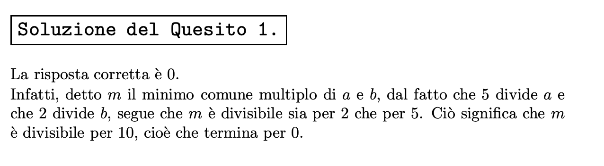

# INDOVINELLI MATEMATICI

> Postare un carosello con prima immagine che ha l'indovinello e seconda la soluzione.
>**SE** non ci stanno sia immagine che testo, mettete solo l'immagine e il testo metterlo in descrizione.

Immagine da usare come background:

### Indovinello della settimana

Di un intero positivo n sappiamo che termina con la cifra 5 e che la cifra delle decine di
n^3 è dispari. Qual è la cifra delle decine di n^3?

**Non pubblicate la soluzione, è per me.**

